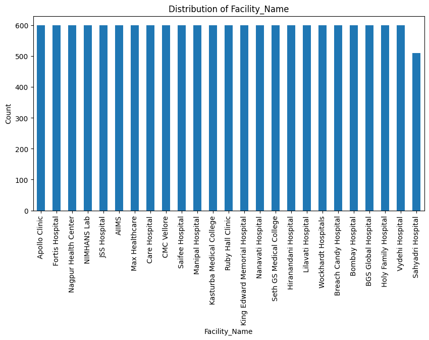
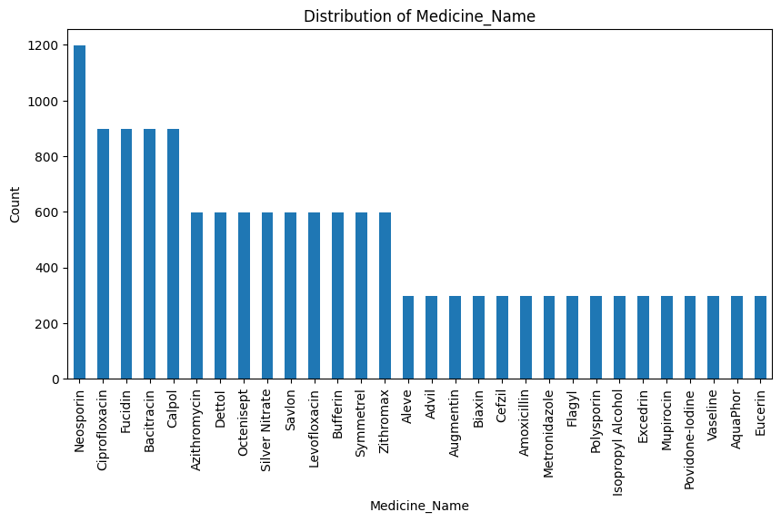
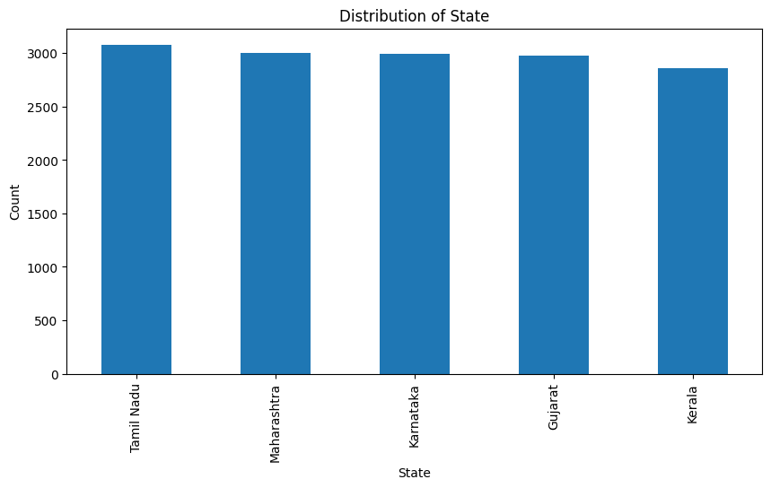
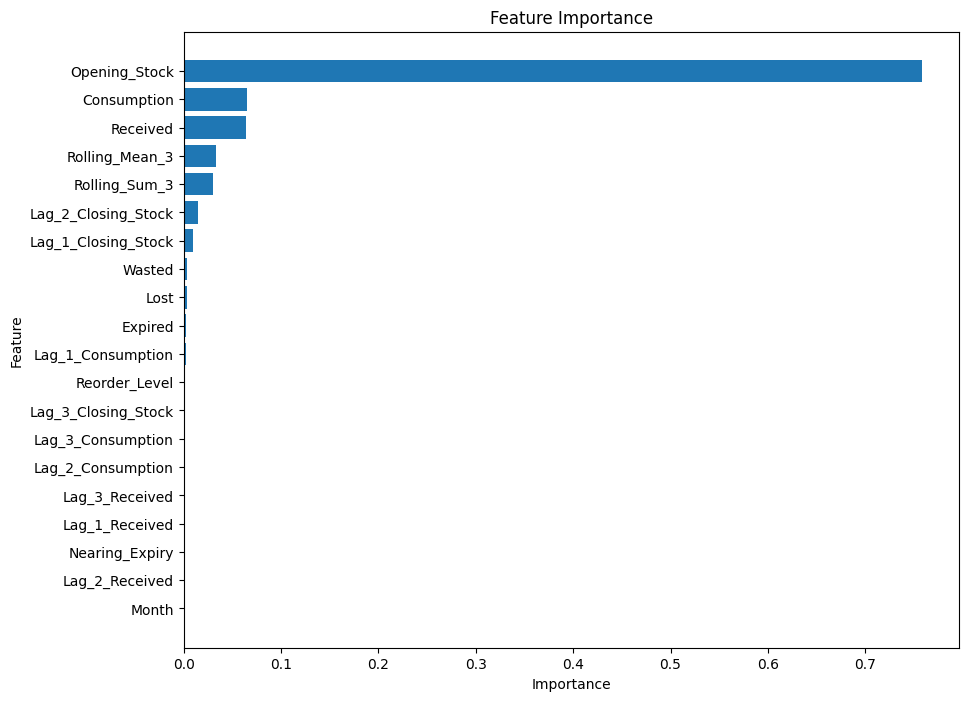

# Pharmaceutical Inventory Demand Forecasting using Machine Learning

Predicting medicine stock levels across Indian healthcare facilities using lag-based and rolling-window feature engineering with a Random Forest regressor — built to explore how historical consumption patterns can support proactive inventory planning and reduce stockout/overstock risk.

## Project Overview

Pharmaceutical supply chains in public health systems face a constant balancing act: too little stock risks patient care, too much stock risks expiry and waste. This project uses historical monthly stock movement data to model medicine demand patterns across facilities, states, and time — as a step toward data-driven reorder planning.

**Dataset scale:**
- 14,700 monthly stock records
- 49 medicines
- 25 healthcare facilities
- 5 Indian states (Gujarat, Tamil Nadu, Karnataka, Kerala, Maharashtra)

> **Note on data:** This dataset is synthetically generated to simulate realistic pharmaceutical inventory patterns. It is used here to demonstrate an end-to-end analytics/ML workflow, not to represent real hospital records.

## Tech Stack

`Python` · `Pandas` · `NumPy` · `Scikit-learn` · `Matplotlib`

## Methodology

1. **Data Loading & Merging** — Combined facility-level stock records (`medicine_stock.csv`) with a medicine reference table (`medicines.csv`) on `Medicine_Name`.
2. **Feature Engineering**
   - Lag features (1–3 months) for `Closing_Stock`, `Consumption`, and `Received`, to capture historical depletion patterns.
   - Rolling 3-month mean and sum of `Closing_Stock`, to smooth short-term fluctuations.
3. **Exploratory Data Analysis** — Stock trend visualization per medicine, rolling statistics plots, and categorical distribution analysis across states, facilities, and medicine types.
4. **Feature Selection** — Recursive Feature Elimination (RFE) with a Random Forest estimator, narrowing to the 20 most predictive features.
5. **Modeling** — Random Forest Regressor, tuned via `GridSearchCV` (max_depth, min_samples_split) with 5-fold cross-validation.
6. **Evaluation** — Mean Squared Error and R² on a held-out test set.

## Visual Exploratory Data Analysis

### Stock Trends Over Time

Closing stock for each medicine plotted across the year — useful for spotting cyclical restocking patterns and sudden drops that may indicate supply issues.

### Rolling Statistics

3-month rolling mean and sum of closing stock, smoothing short-term noise to reveal longer-term trends.

### Geographic Distribution

Record distribution across the 5 states in the dataset — fairly balanced, so no single state dominates the model's training data.

## Results

| Metric | Value |
|---|---|
| Cross-Validation Avg. MSE | 15,372 |
| Optimized Test MSE | 15,201 |
| R² Score | 0.95 |

### Feature Importance

`Opening_Stock` dominates at ~0.75 importance — far above every other feature. This is the clearest evidence of the data leakage discussed below: the model is leaning heavily on a feature that's part of the arithmetic identity determining `Closing_Stock`, rather than learning a genuine demand pattern.

## Known Limitations & Honest Learnings

Being transparent about this because it's the most important thing I learned building it:

- **Target leakage**: `Closing_Stock` is arithmetically derivable from `Opening_Stock + Received − Consumption − Expired − Wasted − Lost`, and the current model includes these same-period columns as features. This inflates the R² score — the model is partly learning an accounting identity rather than a genuine demand pattern. `Opening_Stock` alone accounts for the majority of feature importance, which is the tell.
- **Random train/test split** was used despite this being time-series data, which can leak temporal information across the split.
- A corrected version — predicting **next month's consumption** using only lagged/historical features, with a chronological train/test split — is planned to produce an honest, deployable forecasting model (see Roadmap).

I'm keeping this section in the README deliberately: recognizing and documenting data leakage is a core data science skill, and I'd rather show the full learning process than a polished number that doesn't hold up under scrutiny.

## Work in Progress

This project is under active development. Here's what I'm currently working on and what's planned next:

**In progress right now:**
- Fixing the data leakage issue described above — rebuilding the model to predict **next-period demand** using only historical (lagged) features, instead of current-period stock-movement columns
- Resolving a duplicate-key issue in `medicines.csv` (some medicine names map to multiple, inconsistent category/brand records), which currently causes row duplication when merged with the fact table
- Switching from a random train/test split to a time-based split (`TimeSeriesSplit`), since this is time-series data
- Building a **Power BI dashboard** covering:
  - Stockout risk by state/district/facility (closing stock vs. reorder level)
  - Expiry & wastage hotspots by medicine and facility type
  - Seasonal consumption trends by medicine category

**Planned next:**
-  Add a naive baseline (e.g., 3-month moving average) so the model's value-add can be honestly measured against a simple benchmark
-  Add reorder-point logic: flag facility-medicine pairs predicted to fall below `Reorder_Level`
-  Publish the Power BI dashboard (screenshots + `.pbix` file) alongside the notebook

Contributions, suggestions, and feedback are welcome — feel free to open an issue.

## Repository Structure

```
├── Pharmaceutical_Inventory_Demand.ipynb   # Main analysis & modeling notebook
├── medicine_stock.csv                      # Fact table: monthly stock records
├── medicines.csv                           # Dimension table: medicine metadata
├── requirement.txt                         # Python dependencies
└── README.md
```

## Getting Started

```bash
git clone https://github.com/hamzaikram2026/Pharmaceutical-Inventory-Demand-Forecasting-using-Machine-Learning.git
cd Pharmaceutical-Inventory-Demand-Forecasting-using-Machine-Learning
pip install -r requirement.txt
jupyter notebook Pharmaceutical_Inventory_Demand.ipynb
```

## License

This project is open-sourced for educational and portfolio purposes.
